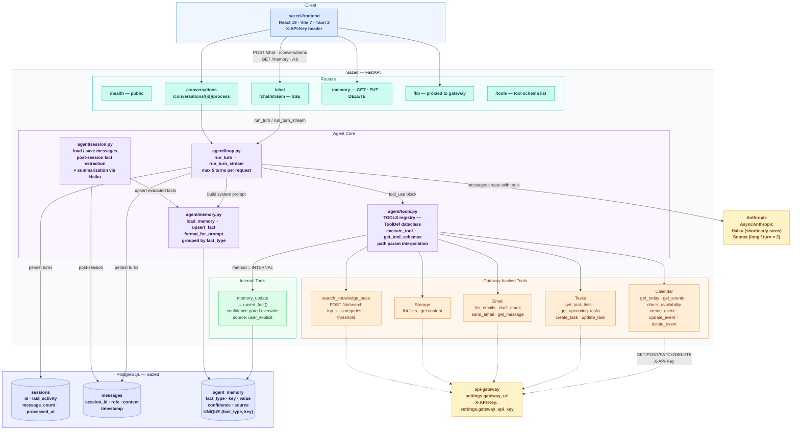
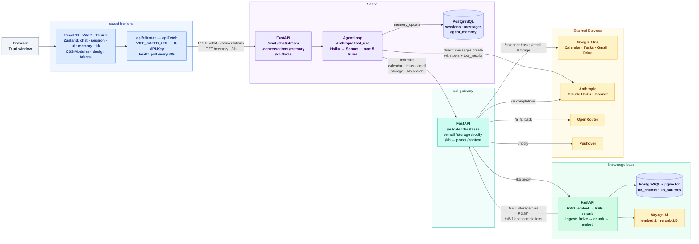

# Sazed — Architecture

Personal AI agent: FastAPI, Anthropic tool-use loop, gateway-backed tools, internal memory and session persistence.

**Color key:** 🔵 Client &nbsp;|&nbsp; 🟢 Routers &nbsp;|&nbsp; 🟣 Agent Core &nbsp;|&nbsp; 🌿 Internal Tools &nbsp;|&nbsp; 🟠 Gateway Tools &nbsp;|&nbsp; 💙 Database &nbsp;|&nbsp; 🟡 External

---

### Agent loop — single turn

| Step | Detail |
|---|---|
| **1. Session** | `INSERT INTO sessions … ON CONFLICT DO NOTHING`. Load all prior `messages` ordered by timestamp. |
| **2. Prompt** | System: today's date + `format_for_prompt(load_memory())` — facts grouped by `fact_type`. |
| **3. Model select** | Haiku if turn 0–2 and message ≤ 500 chars; Sonnet otherwise. |
| **4. LLM call** | `AsyncAnthropic.messages.create(tools=get_tool_schemas(), max_tokens=4096)`. Streaming variant uses `client.messages.stream`. |
| **5. tool_use** | For each `tool_use` block: `execute_tool(name, input)` → INTERNAL (`_execute_internal`) or gateway HTTP call. Result appended as `tool_result`. |
| **6. Persist** | Each assistant turn + tool results saved to `messages` immediately. |
| **7. Loop** | Repeat until `stop_reason = end_turn` or 5 turns exceeded. |
| **8. Finalize** | Update `session.last_activity` and `message_count`. Return text (or SSE: `session`, `tool_start`, `tool_done`, `text_delta`, `done`). |

**Post-session processing** (`/conversations/{id}/process`): Haiku extracts new personal facts from the conversation; `upsert_fact()` saves with confidence-gated overwrite.

---
---

# System Overview — Personal AI Ecosystem

High-level view of all four services, their connections, and external dependencies.

**Color key:** ⬜ User &nbsp;|&nbsp; 🔵 Frontend &nbsp;|&nbsp; 🟣 Sazed &nbsp;|&nbsp; 🟢 api-gateway &nbsp;|&nbsp; 🌿 knowledge-base &nbsp;|&nbsp; 💙 Databases &nbsp;|&nbsp; 🟡 External

---

### Service map

| From | To | Transport | Purpose |
|---|---|---|---|
| sazed-frontend | Sazed | HTTP · SSE | Chat, streaming, conversations, memory, KB UI |
| Sazed | Anthropic | HTTPS | LLM: `AsyncAnthropic.messages.create` with tools |
| Sazed | api-gateway | HTTP | All tool calls: calendar, tasks, email, storage, `/kb/search` |
| api-gateway | knowledge-base | HTTP proxy | `/kb/*` forwarded to `KB_SERVICE_URL/v1*` |
| api-gateway | Google APIs | HTTPS | Calendar, Tasks, Gmail, Drive via OAuth refresh token |
| api-gateway | Anthropic / OpenRouter | HTTPS | `/ai` chat completions |
| api-gateway | Pushover | HTTPS | Push notifications |
| knowledge-base | api-gateway | HTTP | `/storage/files` (sync) · `/ai/v1/chat/completions` (query expansion) |
| knowledge-base | Voyage AI | HTTPS | Embeddings + rerank |
| knowledge-base | PostgreSQL | TCP | `kb_chunks` (vectors + FTS) · `kb_sources` |
| Sazed | PostgreSQL | TCP | `sessions` · `messages` · `agent_memory` |
