```mermaid
flowchart TB
    classDef clientNode fill:#dbeafe,stroke:#3b82f6,color:#1e3a8a,font-weight:bold
    classDef routerNode fill:#ccfbf1,stroke:#14b8a6,color:#134e4a,font-weight:bold
    classDef agentNode  fill:#ede9fe,stroke:#8b5cf6,color:#3b0764,font-weight:bold
    classDef intTool    fill:#dcfce7,stroke:#22c55e,color:#14532d
    classDef gwTool     fill:#ffedd5,stroke:#f97316,color:#7c2d12
    classDef dbNode     fill:#e0e7ff,stroke:#6366f1,color:#1e1b4b,font-weight:bold
    classDef extNode    fill:#fef3c7,stroke:#f59e0b,color:#78350f,font-weight:bold

    subgraph CLIENT["  Client  "]
        FE["sazed-frontend\nReact 19 · Vite 7 · Tauri 2\nX-API-Key header"]
    end

    subgraph SAZED["  Sazed — FastAPI  "]

        subgraph ROUTERS["  Routers  "]
            r_health["/health — public"]
            r_chat["/chat\n/chat/stream — SSE"]
            r_conv["/conversations\n/conversations/{id}/process"]
            r_mem["/memory — GET · PUT · DELETE"]
            r_kb["/kb — proxied to gateway"]
            r_tools["/tools — tool schema list"]
        end

        subgraph AGENT["  Agent Core  "]
            loop["agent/loop.py\nrun_turn  ·  run_turn_stream\nmax 5 turns per request"]
            tools_reg["agent/tools.py\nTOOLS registry — ToolDef dataclass\nexecute_tool  ·  get_tool_schemas\npath param interpolation"]
            session["agent/session.py\nload / save messages\npost-session fact extraction\n+ summarization via Haiku"]
            memory["agent/memory.py\nload_memory  ·  upsert_fact\nformat_for_prompt\ngrouped by fact_type"]
        end

        subgraph INT_TOOLS["  Internal Tools  "]
            mem_upd["memory_update\n→ upsert_fact()\nconfidence-gated overwrite\nsource: user_explicit"]
        end

        subgraph GW_TOOLS["  Gateway-backed Tools  "]
            t_cal["Calendar\nget_today · get_events · check_availability\ncreate_event · update_event · delete_event"]
            t_tasks["Tasks\nget_task_lists · get_upcoming_tasks\ncreate_task · update_task"]
            t_email["Email\nlist_emails · draft_email\nsend_email · get_message"]
            t_storage["Storage\nlist files · get content"]
            t_kb["search_knowledge_base\nPOST /kb/search\ntop_k · categories · threshold"]
        end

    end

    subgraph DB["  PostgreSQL — Sazed  "]
        tbl_sess[("sessions\nid · last_activity\nmessage_count · processed_at")]
        tbl_msgs[("messages\nsession_id · role · content\ntimestamp")]
        tbl_mem[("agent_memory\nfact_type · key · value\nconfidence · source\nUNIQUE (fact_type, key)")]
    end

    GW["api-gateway\nsettings.gateway_url\nX-API-Key: settings.gateway_api_key"]
    ANTH["Anthropic\nAsyncAnthropic\nHaiku (short/early turns)\nSonnet (long / turn > 2)"]

    FE -->|"POST /chat · /conversations\nGET /memory · /kb"| r_chat
    FE --> r_conv
    FE --> r_mem
    FE --> r_kb

    r_chat -->|"run_turn / run_turn_stream"| loop
    r_conv --> loop

    loop -->|"build system prompt"| memory
    loop -->|"messages.create with tools"| ANTH
    loop -->|"tool_use block"| tools_reg
    loop -->|"persist turns"| tbl_sess
    loop -->|"persist turns"| tbl_msgs

    tools_reg -->|"method = INTERNAL"| mem_upd
    tools_reg --> t_cal
    tools_reg --> t_tasks
    tools_reg --> t_email
    tools_reg --> t_storage
    tools_reg --> t_kb

    mem_upd --> tbl_mem
    memory --> tbl_mem

    session -->|"post-session"| tbl_msgs
    session -->|"upsert extracted facts"| memory

    t_cal -.->|"GET/POST/PATCH/DELETE\nX-API-Key"| GW
    t_tasks -.-> GW
    t_email -.-> GW
    t_storage -.-> GW
    t_kb -.-> GW

    class FE clientNode
    class r_health,r_chat,r_conv,r_mem,r_kb,r_tools routerNode
    class loop,tools_reg,session,memory agentNode
    class mem_upd intTool
    class t_cal,t_tasks,t_email,t_storage,t_kb gwTool
    class tbl_sess,tbl_msgs,tbl_mem dbNode
    class GW,ANTH extNode

    style CLIENT    fill:#eff6ff,stroke:#3b82f6,color:#1e3a8a
    style SAZED     fill:#f8fafc,stroke:#cbd5e1,color:#0f172a
    style ROUTERS   fill:#f0fdfa,stroke:#14b8a6,color:#134e4a
    style AGENT     fill:#faf5ff,stroke:#8b5cf6,color:#3b0764
    style INT_TOOLS fill:#f0fdf4,stroke:#22c55e,color:#14532d
    style GW_TOOLS  fill:#fff7ed,stroke:#f97316,color:#7c2d12
    style DB        fill:#eef2ff,stroke:#6366f1,color:#1e1b4b
```

```mermaid
flowchart LR
    classDef userNode  fill:#f1f5f9,stroke:#64748b,color:#1e293b,font-weight:bold
    classDef feNode    fill:#dbeafe,stroke:#3b82f6,color:#1e3a8a,font-weight:bold
    classDef sazNode   fill:#ede9fe,stroke:#8b5cf6,color:#3b0764,font-weight:bold
    classDef gwNode    fill:#ccfbf1,stroke:#14b8a6,color:#134e4a,font-weight:bold
    classDef kbNode    fill:#d1fae5,stroke:#10b981,color:#064e3b,font-weight:bold
    classDef dbNode    fill:#e0e7ff,stroke:#6366f1,color:#1e1b4b,font-weight:bold
    classDef extNode   fill:#fef3c7,stroke:#f59e0b,color:#78350f,font-weight:bold

    USER["Browser\nTauri window"]

    subgraph FE["  sazed-frontend  "]
        fe_ui["React 19 · Vite 7 · Tauri 2\nZustand: chat · session · ui · memory · kb\nCSS Modules · design tokens"]
        fe_api["api/client.ts — apiFetch\nVITE_SAZED_URL  ·  X-API-Key\nhealth poll every 30s"]
    end

    subgraph SAZ["  Sazed  "]
        s_routes["FastAPI\n/chat  /chat/stream\n/conversations  /memory\n/kb  /tools"]
        s_agent["Agent loop\nAnthropic tool_use\nHaiku → Sonnet  ·  max 5 turns"]
        s_db[("PostgreSQL\nsessions · messages\nagent_memory")]
    end

    subgraph GW["  api-gateway  "]
        g_routes["FastAPI\n/ai  /calendar  /tasks\n/email  /storage  /notify\n/kb → proxy  /context"]
    end

    subgraph KB["  knowledge-base  "]
        kb_rag["FastAPI\nRAG: embed → RRF → rerank\nIngest: Drive → chunk → embed"]
        kb_db[("PostgreSQL + pgvector\nkb_chunks · kb_sources")]
        kb_voyage["Voyage AI\nembed-2  ·  rerank-2.5"]
    end

    subgraph EXT["  External Services  "]
        google["Google APIs\nCalendar · Tasks · Gmail · Drive"]
        anthropic["Anthropic\nClaude Haiku + Sonnet"]
        openrouter["OpenRouter"]
        pushover["Pushover"]
    end

    USER --> fe_ui
    fe_ui --> fe_api

    fe_api -->|"POST /chat · /conversations\nGET /memory · /kb"| s_routes
    s_routes --> s_agent
    s_agent -->|"memory_update"| s_db
    s_agent -->|"direct: messages.create\nwith tools + tool_results"| anthropic

    s_agent -->|"tool calls\ncalendar · tasks · email\nstorage · /kb/search"| g_routes

    g_routes -->|"/calendar /tasks /email /storage"| google
    g_routes -->|"/ai completions"| anthropic
    g_routes -->|"/ai fallback"| openrouter
    g_routes -->|"/notify"| pushover
    g_routes -->|"/kb proxy"| kb_rag

    kb_rag --> kb_db
    kb_rag --> kb_voyage
    kb_rag -->|"GET /storage/files\nPOST /ai/v1/chat/completions"| g_routes

    class USER userNode
    class fe_ui,fe_api feNode
    class s_routes,s_agent sazNode
    class s_db dbNode
    class g_routes gwNode
    class kb_rag kbNode
    class kb_db dbNode
    class kb_voyage,google,anthropic,openrouter,pushover extNode

    style FE   fill:#eff6ff,stroke:#3b82f6,color:#1e3a8a
    style SAZ  fill:#faf5ff,stroke:#8b5cf6,color:#3b0764
    style GW   fill:#f0fdfa,stroke:#14b8a6,color:#134e4a
    style KB   fill:#ecfdf5,stroke:#10b981,color:#064e3b
    style EXT  fill:#fffbeb,stroke:#f59e0b,color:#78350f
```

# Sazed — Architecture

Personal AI agent: FastAPI, Anthropic tool-use loop, gateway-backed tools, internal memory and session persistence.

**Color key:** 🔵 Client  |  🟢 Routers  |  🟣 Agent Core  |  🌿 Internal Tools  |  🟠 Gateway Tools  |  💙 Database  |  🟡 External

---

### Agent loop — single turn

| Step | Detail |
|---|---|
| **1. Session** | `INSERT INTO sessions … ON CONFLICT DO NOTHING`. Load all prior `messages` ordered by timestamp. |
| **2. Prompt** | System: today's date + `format_for_prompt(load_memory())` — facts grouped by `fact_type`. |
| **3. Model select** | Haiku if turn 0–2 and message ≤ 500 chars; Sonnet otherwise. |
| **4. LLM call** | `AsyncAnthropic.messages.create(tools=get_tool_schemas(), max_tokens=4096)`. Streaming variant uses `client.messages.stream`. |
| **5. tool_use** | For each `tool_use` block: `execute_tool(name, input)` → INTERNAL (`_execute_internal`) or gateway HTTP call. Result appended as `tool_result`. |
| **6. Persist** | Each assistant turn + tool results saved to `messages` immediately. |
| **7. Loop** | Repeat until `stop_reason = end_turn` or 5 turns exceeded. |
| **8. Finalize** | Update `session.last_activity` and `message_count`. Return text (or SSE: `session`, `tool_start`, `tool_done`, `text_delta`, `done`). |

**Post-session processing** (`/conversations/{id}/process`): Haiku extracts new personal facts from the conversation; `upsert_fact()` saves with confidence-gated overwrite.

---
---

# System Overview — Personal AI Ecosystem

High-level view of all four services, their connections, and external dependencies.

**Color key:** ⬜ User  |  🔵 Frontend  |  🟣 Sazed  |  🟢 api-gateway  |  🌿 knowledge-base  |  💙 Databases  |  🟡 External

---

### Service map

| From | To | Transport | Purpose |
|---|---|---|---|
| sazed-frontend | Sazed | HTTP · SSE | Chat, streaming, conversations, memory, KB UI |
| Sazed | Anthropic | HTTPS | LLM: `AsyncAnthropic.messages.create` with tools |
| Sazed | api-gateway | HTTP | All tool calls: calendar, tasks, email, storage, `/kb/search` |
| api-gateway | knowledge-base | HTTP proxy | `/kb/*` forwarded to `KB_SERVICE_URL/v1*` |
| api-gateway | Google APIs | HTTPS | Calendar, Tasks, Gmail, Drive via OAuth refresh token |
| api-gateway | Anthropic / OpenRouter | HTTPS | `/ai` chat completions |
| api-gateway | Pushover | HTTPS | Push notifications |
| knowledge-base | api-gateway | HTTP | `/storage/files` (sync) · `/ai/v1/chat/completions` (query expansion) |
| knowledge-base | Voyage AI | HTTPS | Embeddings + rerank |
| knowledge-base | PostgreSQL | TCP | `kb_chunks` (vectors + FTS) · `kb_sources` |
| Sazed | PostgreSQL | TCP | `sessions` · `messages` · `agent_memory` |
