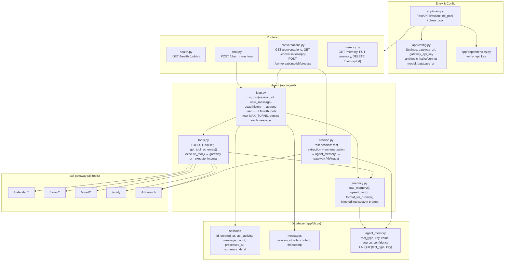

# Sazed — Detailed Architecture

Specific structure: entry point, routers, agent loop, tools, and database.

**Key files:**

| File | Role |
|------|------|
| `app/main.py` | Mounts health, chat, conversations, memory; lifespan manages pool |
| `app/agent/loop.py` | run_turn: load session, build system prompt (with memory), LLM with tool_use, execute_tool, persist messages |
| `app/agent/tools.py` | ToolDef list (calendar, tasks, email, notify, search_knowledge_base, memory_update); execute_tool → httpx to gateway or internal |
| `app/agent/memory.py` | load_memory, upsert_fact (confidence-based), format_for_prompt for system prompt |
| `app/agent/session.py` | Post-session processing: extract facts, summarize, ingest summary to KB |
| `app/db.py` | asyncpg pool, sessions / messages / agent_memory schema |
