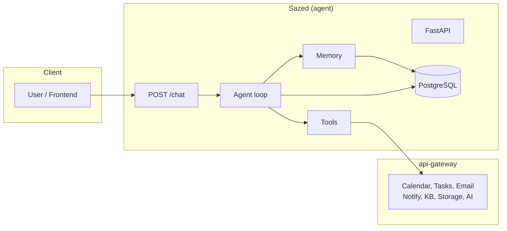

# Sazed — Architecture Overview

High-level view for quickly understanding the codebase.

**In one sentence:** FastAPI agent that runs an LLM loop with tool use, persists sessions and structured memory in Postgres, and calls the api-gateway for calendar, tasks, email, KB, and notifications.
